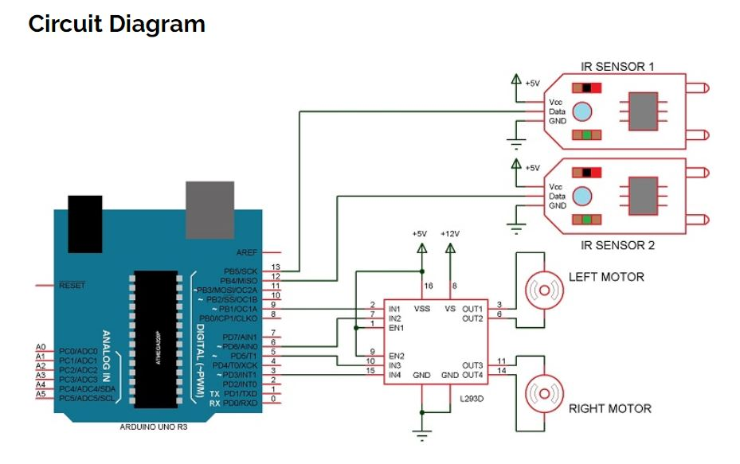
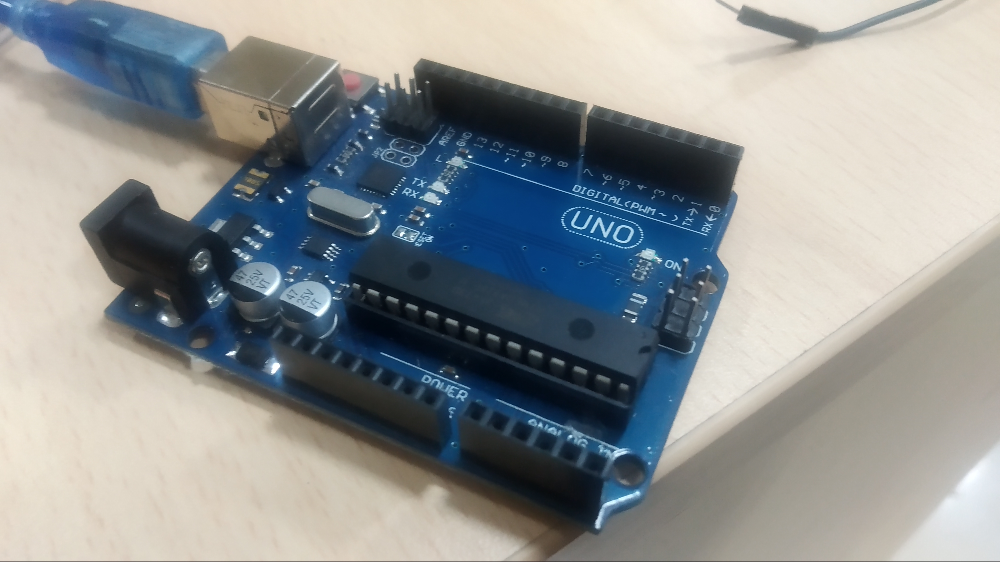

# Line-follwing-Bot

## *About* 
This is a basic Ardiuno project. In this I have used IR sensors to move the bot on the line in this case black line I have used digital inputs you can try with analog inputs and try to move it on different colors. 

### *Working*
In this project, we have designed an Arduino based Line Follower Robot. The working of the project is pretty simple: detect the black line on the surface and move along that line. The detailed working is explained here.

As mentioned in the block diagram, we need sensors to detect the line. For line detection logic, we used two IR Sensors, which consists of IR LED and Photodiode. They are placed in a reflective way i.e. side – by – side so that whenever they come in to proximity of a reflective surface, the light emitted by IR LED will be detected by Photo diode.

The following image shows the working of a typical IR Sensor (IR LED – Photodiode pair) in front of a light coloured surface and a black surface. As the reflectance of the light coloured surface is high, the infrared light emitted by IR LED will be maximum reflected and will be detected by the Photodiode.

### *Things required*
* **Ardiuno UNO**
* **2 12V DC Motors**
* **L293D Motor driver**
* **2 IR Sensors**
* **Jumpping Wires**
* **9-11V Battery**

**Ardiuno UNO**

**IR sensor**

**Castor Wheel**

**L293D Moter driver**

**DC Moter**

**My Bot**

### Applications of Line Follower Robot
* Line follower Robots are commonly used for automation process in industries, military applications and consumer applications.
* They are very useful as they can work without any supervision i.e. they work as automatic guided vehicles.
* With additional features like obstacle avoidance and other security measures, line follower robots can be used in driver less cars. 
